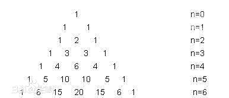
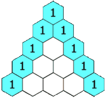

## 杨辉三角

### 1.概念
+ 每一行首尾两个数字都是1、中间的数字等于上一行相邻两个数字的和、即排列组合中通常所运用的： C(m,n) = C(m-1,n-1)+C(m-1,n)
+ 每行数字左右对称，由1开始逐渐变大。
+ 第n行的数字有n项。
<div align="center"></div>

### 2.代码实现
```js
function Combination(m,n){
    return (n==0 || m==n)? 1: Combination(m-1,n-1)+Combination(m-1,n)
}
function Pascal(n){
    for(var i = 0;i<n;i++){
        var a = [];
        for(var j = 0;j<=i;j++){
            a.push(Combination(i,j))//递归实现
            //(j==0 || i==j)?a.push(1):a.push(arr[i-1][j-1]+arr[i-1][j]);//非递归实现
        }
        arr.push(a)
    }
}
console.log(Pascal(10));
```
实现过程如下图：
<div align="center"></div>
