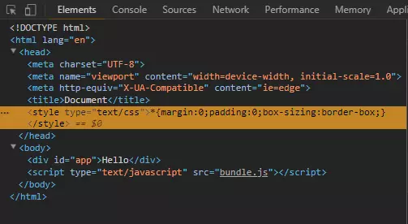
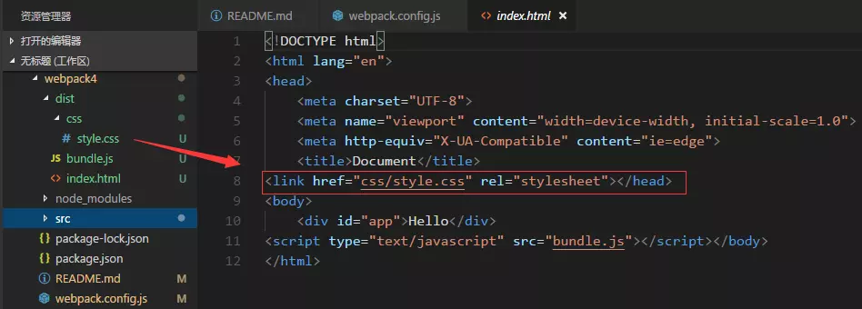

## 从零搭建 webpack 配置 - 引用 css(基于 webpack4.x)

打包 css 分为两种方式：一种是以行内样式 style 的标签写进打包后的 html 页面中，

1. 安装 style-loader 和 css-loader

```
npm i style-loader css-loader -D
// 引入less文件的话，也需要安装对应的loader
npm i less less-loader -D
```

2. 在 index.js 引入 css

```
// index.js
import './css/style.css';   // 引入css
```

3.  配置 webpack.config.js

```
module.exports = {
    //...
    module: {
        rules: [
            {
                test: /\.css$/,     // 解析css
                use: ['style-loader', 'css-loader'] // 从右向左解析
            }
        ]
    }
}
```

<div align="center"></div>

另外一种是拆分 css，用 link 的方式引入进去。
1. 安装extract-text-webpack-plugin
```
// @next表示可以支持webpack4版本的插件
npm i extract-text-webpack-plugin@next -D
```
2. 配置webpack.config.js
```
let ExtractTextWebpackPlugin = require('extract-text-webpack-plugin');

module.exports = {
    //...
    module: {
        rules: [
            {
                test: /\.css$/,
                use: ExtractTextWebpackPlugin.extract({
                    // 将css用link的方式引入就不再需要style-loader了
                    use: 'css-loader'       
                })
            }
        ]
    },
    plugins: [
        //...
        // 拆分后会把css文件放到dist目录下的css/style.css
        new ExtractTextWebpackPlugin('css/style.css')  
    ]
}
```
此时拆分完css后，打包的html页面就以link的方式去引入css了，这样很好。
<div align="center"></div>

### 待办事项
-[x] style-loader和css-loader的作用和原理