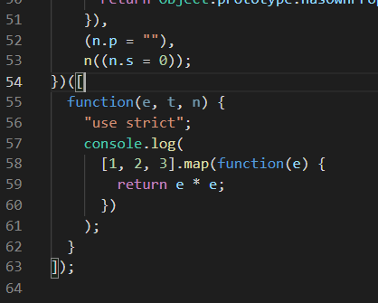

## 从零搭建 webpack 配置 - ES6(基于 webpack4.x)

1. 安装 babel-loader、babel-core、babel-preset-env

```
npm install -D babel-loader babel-core babel-preset-env
```

注：如果 babel-loader 的版本是 8.x，对应安装的是@babel/core、@babel/preset-env。如果 babel-loader 的版本是 7.x，对应安装的才是 babel-core、babel-preset-env。

这三个文件是必须的，但彼此的作用各不相同。

> babel-loader：虽然 webpack 本身就能够处理.js 文件，但无法对 ES2015+的语法进行转换。babel-loader 的作用正是实现对使用了 ES2015+语法的.js 文件进行处理，也就是把高级语法转为至低级语法，使浏览器兼容识别。

> babel-core：babel 的 node API 已经被移到 babel-core 中，所以 babel-core 的作用在于提供一系列 api。这便是说，当 webpack 使用 babel-loader 处理文件时，babel-loader 实际上调用了 babel-core 的 api。

> babel-preset-env：告诉 babel 使用哪种转码规则进行文件处理。

如果还没有安装 webpack 的话，你还需要 install 呢，猪头欢。webpack4.x 之后还需要安装 webpack-cli。

```
npm install -D webpack webpack-cli
```

2. 配置 babel 规则

配置 babel 规则有两种方式。一是通过 package.json，在 package.json 文件中增加一个“babel"属性，该属性是一个 JSON 对象，作用是设置项目中的 babel 转码规则和使用到的 babel 插件。

```
"babel":{
  "presets": ["env"], //设置转码规则，告诉npm本项目使用bable-preset-env规则进行转码
  "plugins": [] //设置使用到的插件
}
```

另一种方式是通过.babelrc 文件。在项目根目录下新建.babelrc 文件：

```
{
  "presets": ["env"]
}
```

3. 新建和配置 webpack.config.js

仅有上面仍然不能起作用，虽然上面已经配置好 babel 的规则，但 webpack 仍然不知道何时何地使用该规则，这便需要使用 webpack.config.js 文件。在根目录下新建 webpack.config.js 文件：

```
const path = require("path");

module.exports={
    entry: "./src/index.js",
    output: {
      filename: "main.js", // 打包后的文件名称
      path: path.resolve("dist") // 打包后的目录，必须是绝对路径
    },
    module:{
        rules:[
            {
                test: /\.js$/, //babel-loader很慢，需要确保转译尽可能少的文件。
                exclude: /node_modules/,
                loader: "babel-loader"
            }
        ]
    }

}
```

4. 运行并查看结果

index.js 内容如下：

```
console.log([1, 2, 3].map(val => val * val));
```

在 package.json 文件的"scripts"属性下增加了"build"属性

```
"scripts": {
    "build":"webpack --mode production"
}
```

现在，在命令行定位到项目根目录，执行

```
npm run build
```

运行之后，你觉得可以了？但是控制台会报错：

```
ERROR in ./src/index.js
Module build failed (from ./node_modules/_babel-loader@8.0.5@babel-loader/lib/index.js):
Error: Cannot find module '@babel/core'
 babel-loader@8 requires Babel 7.x (the package '@babel/core'). If you'd like to use Babel 6.x ('babel-core'), you should install 'babel-loader@7'.
```

他的意思就是找不到@babel/core，babel-loader@8 版本以上都需要引入@babel/core7.x 以上，看一眼我们的 package.json：

```
"babel-core": "^6.26.3",
"babel-loader": "^8.0.5",
"babel-preset-env": "^1.7.0",
```

所以需要安装@babel/core @babel/preset-env。其实官方文档已经说得很清楚啦，只是你没看。[webpack 官方文档 babel-loader](https://webpack.docschina.org/loaders/babel-loader/#%E4%B8%AD%E6%96%87%E6%96%87%E6%A1%A3)

```
npm install -D @babel/core @babel/preset-env
```

打包完成后，可以看到 dist 文件下多了 main.js。你就会发现之前在 index.js 写的箭头函数，已经被转译成 function 的形式了。ok，搞定啦！！！

<div align="center">  </div>

<br/><br/>

### 控制台报错：Cannot read property 'bindings' of null

```
//index.js
let a = 1;
console.log(a);
console.log([1, 2, 3].map(val => val * val));
```

当修改 index.js 为上面内容的时候，控制台就会报错：

```
TypeError: Cannot read property 'bindings' of null
    at Scope.moveBindingTo (C:\Users\EDZ\Desktop\demo\blog\node_modules\_@babel_traverse@7.4.0@@babel\traverse\lib\scope\index.js:864:13)
    at BlockScoping.updateScopeInfo (C:\Users\EDZ\Desktop\demo\blog\node_modules\_babel-plugin-transform-es2015-block-scoping@6.26.0@babel-plugin-transform-es2015-block-scoping\lib\index.js:364:17)
```

原因：Babel 版本中的错过匹配引起的（v6 vs v7）。有人在 github 的 issues 的评论提出了解决方案：[https://github.com/storybooks/storybook/issues/3937](https://github.com/storybooks/storybook/issues/3937)  
解决方案：修改.babelrc 文件

```
{
  "presets": ["@babel/preset-env"]
}
```

<br/><br/>

### .babelrc的presets和plugins配置解析
Babel插件一般尽可能拆成小的力度，开发者可以按需引进。比如对ES6转ES5的功能，Babel官方拆成了20+个插件。<br/><br/>
这样的好处显而易见，既提高了性能，也提高了扩展性。比如开发者想要体验ES6的箭头函数特性，那他只需要引入transform-es2015-arrow-functions插件就可以，而不是加载ES6全家桶。

#### 一：plugins(插件)
先简单介绍下 plugins ，babel中的插件，通过配置不同的插件才能告诉babel，我们的代码中有哪些是需要转译的。
```
{
    "plugins": [
        "transform-es2015-arrow-functions", //转译箭头函数
        "transform-es2015-classes", //转译class语法
        "transform-es2015-spread", //转译数组解构
        "transform-es2015-for-of" //转译for-of
    ]
}
```
下面介绍一些几个plugin：
1. transform-es2015-arrow-functions：只引入箭头函数这个es6特性。  
```
{
  "plugins": ["transform-es2015-arrow-functions"]
}
```
2. transform-runtime  
这个插件最大的作用主要有几下几点：
  - 解决编译中产生的重复的工具函数，减小代码体积
  - 非实例方法的poly-fill，如Object.assign，但是实例方法不支持，如"foobar".includes("foo")，这时候需要单独引入babel-polyfill
```
{
  "plugins": ["transform-runtime", options]
}
```
这里的options一般不用自己设置，用默认的即可。更多细节参见[文档](https://babeljs.io/docs/plugins/transform-runtime/)。

3. transform-remove-console  
使用这个插件，编译后的代码都会移除console.*，妈妈再也不用担心线上代码有多余的console.log了。当然很多时候，我们如果使用webpack，会在webpack中配置。
```
{
  "plugins": ["transform-remove-console"]
}
```

### 二：presets(预设)
显然这样一个一个配置插件会非常的麻烦，为了方便，babel为我们提供了一个配置项叫做persets（预设），预设就是一系列插件的集合。  
如果要转译ES6语法，添加ES6全家桶，只要按如下方式配置即可： 
```
//先安装@babel/preset-env
{
    "presets": ["@babel/preset-env"]
}
```

### 三：Plugin与Preset执行顺序
可以同时使用多个Plugin和Preset，此时，它们的执行顺序非常重要。  
- 具体而言，plugins优先于presets进行编译。
- plugins按照数组的index增序(从数组第一个到最后一个)进行编译。
- presets按照数组的index倒序(从数组最后一个到第一个)进行编译
