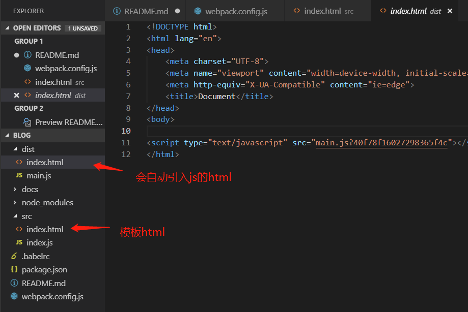

## 从零搭建 webpack 配置 - 配置HTML模板(基于webpack4.x)

文件都打包好了，但是我们在使用的时候不能在dist目录下去创建一个html文件，然后去引用打包后的js吧，这不合理，实际开发中也不会这样。我们需要实现html打包功能，可以通过一个模板实现打包出引用好路径的html来。

1. 安装html-webpack-plugin
```
npm i html-webpack-plugin -D
```

2. 在webpack.config.js添加配置
```js
let path = require('path');
let HtmlWebpackPlugin = require('html-webpack-plugin');

module.exports = {
    //...
    plugins: [
        // 通过new一下这个类来使用插件
        new HtmlWebpackPlugin({
            // 用哪个html作为模板
            // 在src目录下创建一个index.html页面当做模板来用
            template: './src/index.html',
            hash: true, // 会在打包好的bundle.js后面加上hash串
        })
    ]
}
```
3. 通过上面的配置后，我们再npm run build打包看一下现在是个什么样子了
<div align="center">  </div>