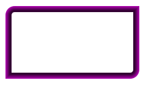
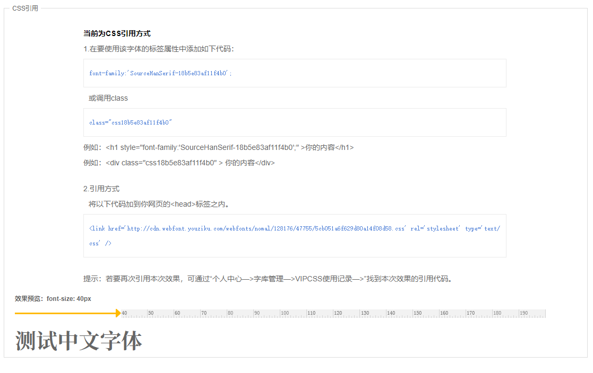

### 设置边框颜色渐变

边框颜色渐变分两种情况：一是从上到下边框颜色渐变：

<div align="center"></div>

```
.box{
    width: 100px;
    height: 100px;
    border:10px solid #ddd;
    border-image: linear-gradient(#F80, #2ED) 20 20;
}
```

另一种是从外到里边框颜色渐变， 每一条边框都设置了 5 种颜色，且都占据着 5px 的宽度。这个时候每种颜色的 border-width 为 1px。事实上，如果我们边框设置了 x 个像素的宽度，并且为每条边框设置了 y 种颜色，若 x>y，则前 y-1 种颜色每种占据了 1px，最后一种颜色占据 x-y+1 个像素。

<div align="center"></div>

```
.box {
    width: 200px;
    height: 100px;
    border: 10px solid transparent;
    border-radius: 15px 0 15px 0;
    -moz-border-top-colors:#a0a #909 #808 #707 #606 #505 #404 #303;
    -moz-border-right-colors:#a0a #909 #808 #707 #606 #505 #404 #303;
    -moz-border-bottom-colors:#a0a #909 #808 #707 #606 #505 #404 #303;
    -moz-border-left-colors:#a0a #909 #808 #707 #606 #505 #404 #303;
}
```

## 引入特殊字体

对于英文字体，通过 font-family 属性来引用字体的名称。

```
@font-face{
    font-family: myFirstFont;
    src: url(sansation_light.woff);
}
div{
    font-family:myFirstFont;
}
```

由于英文字母只有 26 个，所以生成.eot、.woff、.ttf、.svg 等文件是比较小的，也就十几 KB 而已。但是对于汉字来说，常用的汉字就已经 2500 个了，生成的文件一般要 2-3MB，如此庞大的包对页面的加载时非常不利的。所以，对于中文字体，我就可以使用[有字库](https://www.youziku.com/)，原理就是只生成你需要的那些字体的文件。例如只需要四个字“温馨提示”，那么就只生成包含这四个字的特殊字体。下面是使用有字库后，引入 css 的方式：

<div align="center"></div>

## 控制中英文的单词间隔

> word-spacing：用于单词和标签的直接间距行为。  
> letter-spacing：用于文字的间距行为。

从字面意思就知道了，word-spacing 用于英文单词间隔，letter-spacing 用于中文汉字的间隔。

```
// 没有设置间距的汉字和字母 
顺昌人 
this is a test 

// 设置50px的word-spacing字间距 
顺昌人 
this       is       a       test 

// 设置50px的letter-spacing字母间距 
顺       昌       人 
t       h       i       s i       s a t       e       s       t 
```

