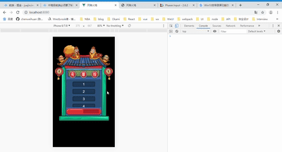
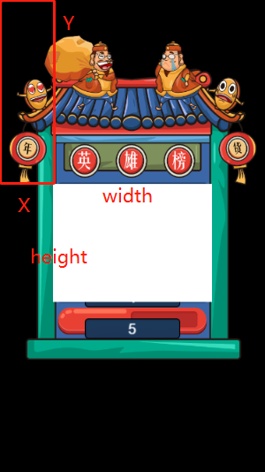
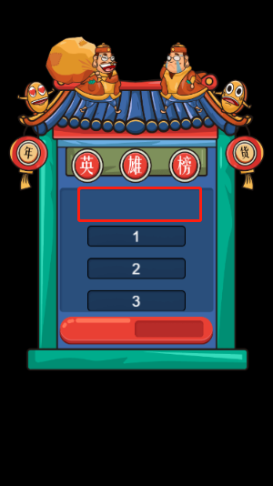

## 基于phaser的滚动排行榜

效果图，[源代码传送门](./src)
<div align="center"></div>

1. 设置mask
排行榜的关键点在于怎么使元素上下移动，参考[官方example](http://phaser.io/examples/v2/sprites/sprite-group-mask)后，使用mask属性对元素进行移动。其实就是添加一个遮盖层，节点元素可以在上面移动，出了遮盖层区域就显示不了，这刚刚好符合滚动排行榜的需求呀。
```js
let groupScore = game.add.group();//需要滚动的元素组
let gameWidth = game.world.width,//游戏屏幕宽度
    gameHeight = game.world.height;//游戏屏幕高度
let maskX = gameWidth * 0.2,
    maskY = gameHeight * 0.39,
    maskWidth = gameWidth * 0.6,
    maskHeight = gameHeight * 0.25;
let mask = game.add.graphics(0, 0);
mask.beginFill(0xffffff);
mask.drawRect(maskX, maskY, maskWidth, maskHeight);
groupScore.mask = mask;
```
具体效果如下图，白色那块就是mask部分。
<div align="left"></div>

2. 监听手指在mask范围内触摸移动
当用户在mask区域上下滑动的时候，排行榜才开始滚动，下面就是监听手指是否在mask范围内上下滑动。
```js
let touching = false;
// 监听按下事件
game.input.onDown.add(pointer => {
    //获取mask的位置，例如x坐标、y坐标、width和height
    let maskBounds = mask._localBounds;
    if (
        (maskBounds.y < pointer.y && pointer.y < maskBounds.y + maskBounds.height) &&
        (maskBounds.x < pointer.x && pointer.x < maskBounds.x + maskBounds.width)) {
        touching = true;
    }
});
// 监听离开事件
game.input.onUp.add(() => {
    touching = false;
});
```

3. 最后一步，开始滑动。
排行榜滑动分为两种情况，一是手指往下滑而且没到顶部，二是手指往上滑而且没到底部。
```js
let pointerY = 0;//记录上次触摸的y轴坐标
game.input.addMoveCallback(MoveCallback);

// 手指滑动事件的回调函数
function MoveCallback(pointer, x, y, isTap) { 
  //isTap：说明移动是否是“单击”事件，true为点击事件，false为触摸事件。
  let isTop = false,//是否到达顶部
    isBottom = false,//是否到达底部
    groupScoreFirstChild = groupScore.children[0],//group的第一个儿子，也就是最顶部的那个元素
    groupScoreLastChild = groupScore.children[groupScore.children.length - 1];//最后一个儿子，也就是最底部的元素
  //判断是否到达顶部
  if (groupScoreFirstChild.y - 20 > maskY) isTop = true;
  //判断是否到达底部
  if (groupScoreLastChild.y + 20 < maskY + maskHeight) isBottom = true;
  //只有两种情况能移动：手指往下滑而且没到顶部、手指往上滑而且没到底部
  if (
    (!isTap && touching && pointerY < y && !isTop) || //手指往下滑而且没到顶部
    (!isTap && touching && pointerY > y && !isBottom) //手指往上滑而且没到底部
  ) {
    groupScore.children.forEach(val => {
      val.y = val.y + (y - pointerY);
    });
    pointerY = y;
  }
}
```

### 优化
1. 添加节流函数
因为最后是监听触摸函数，所以会频繁触发手指滑动事件的回调函数，设置节流函数防止执行太快。
```js
 // 监听滑动事件
game.input.addMoveCallback(throttle(MoveCallback, 10));

// 节流函数
function throttle(func, wait) {
  var context, args;
  var previous = 0;
  return function () {
    var now = +new Date();
    context = this;
    args = arguments;
    if (now - previous > wait) {
      func.apply(context, args);
      previous = now;
    }
  }
}
```

### 待办事项
1. 如果瞬间由上往下划或者由下往上划，会出现排行榜滑动过度。暂时还没有找到解决办法...
<div align="left"></div>