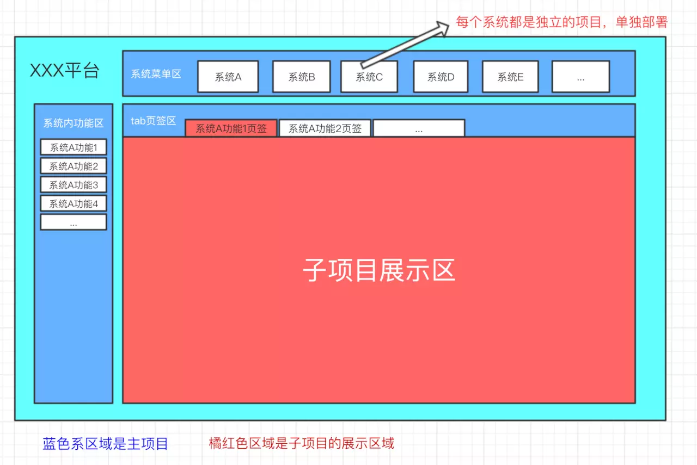

## 微前端入门

### 微前端是什么？
微前端就是可以把庞大的项目分为若干个项目，独自开发、部署和交付，而且与技术栈无关（你可以把两个分别是vue和react技术栈的项目糅合在一起）。

### 解决痛点
1. 中后台应用由于其应用生命周期长(动辄 3+ 年)等特点，最后演变成一个巨石应用的概率往往高于其他类型的 web 应用。我所在团队就是做B端业务，时间越久，项目越大，后端接口动不动就是几百个。
2. 前端遗留系统的迁移。过去那些使用 Backbone.js、Angular.js、Vue.js 1 等等框架所编写的单页面应用，已经在线上稳定地运行着。而这些应用又需要结合到新应用中使用。例如，旧的应用使用的是 react 编写，而新的应用开始采用 vue。

### 怎么做？
当前的[single-spa](https://single-spa.js.org/docs/ecosystem-vue)比较火，可以轻松构建微前端应用。  
- [官方-vue-demo](https://github.com/joeldenning/coexisting-vue-microfrontends)  
- [社区-microfrontend-admin](https://github.com/MarioLuLu7/microfrontend-admin)  

### 重点
1. 减少打包体积：这么多同类型的项目，一定有大量的重复代码、重复引用，所以这是一块巨大的性能优化点，通过配置externals可以极大减小子项目打包出来的体积。
2. 因为是多个项目糅合在一起，需要避免全局变量污染、全局监听污染、样式污染等，需要制定接入规范。
3. 不同应用的通信。我们建议应该尽可能少地通信，因为这通常会引入不必要的耦合，不过跨应用通信的需求还是存在的。可以使用自定义事件通信，还可以使用地址栏作为通信桥梁。

相关文章：
- [可能是你见过最完善的微前端解决方案](https://zhuanlan.zhihu.com/p/78362028)
- [微前端入门](https://juejin.im/post/5d8adb8ff265da5ba12cd173)
- [每日优鲜供应链前端团队微前端改造](https://juejin.im/post/5d7f702ce51d4561f777e258)
- [微前端的那些事儿](https://github.com/phodal/microfrontends)