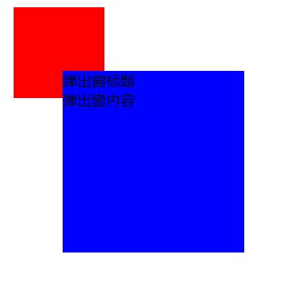

## 实现弹出窗popover

### 第一种：在点击处显示弹出窗
<div align="center" ></div>

```vue
// App.vue
<template>
  <div id="app" style="position:relative;margin:20px;">
    <div class="div" @click="test"></div>
    <infoPopover v-model="infoVisible"></infoPopover>
  </div>
</template>

<script>
import infoPopover from './infoPopover'
export default {
  components: { infoPopover },
  data () {
    return {
      infoVisible: false
    }
  },
  methods: {
    test (e) {
      this.infoVisible = true
      let container = document.querySelector('.container')
      container.style.left = e.offsetX + 'px'
      container.style.top = e.offsetY + 'px'
    }
  }
}
</script>
<style>
.div {
  width: 100px;
  height: 100px;
  background-color: red;
}
</style>
```

```vue
// infoPopover.vue
<template>
  <custom-drop-down v-model="visible">
    <template slot="header">标题</template>
    <div>内容</div>
  </custom-drop-down>
</template>
<script>
import customDropDown from './customDropDown'
export default {
  props: ['value'],
  components: { customDropDown },
  computed: {
    visible: {
      get () {
        return this.value
      },
      set (val) {
        this.$emit('input', val)
      }
    },
  }
}
</script>
```

```vue
// customDropDown.vue
<template>
  <div class="container" ref="dropdown" v-show="value">
    <header><slot name="header"></slot></header>
    <slot></slot>
  </div>
</template>
<script>
export default {
  props: ['value'],
  methods: {
    evtHandler (e) {
      // composedPath：当对象数组调用该侦听器时返回事件路径
      if (e.composedPath().indexOf(this.$refs.dropdown) == -1) {
        this.$emit('input', false)
      }
    }
  },
  watch: {
    value (val) {
      if (val) {
        setTimeout(() => {
          window.addEventListener('click', this.evtHandler)
        }, 0)
      } else {
        window.removeEventListener('click', this.evtHandler)
      }
    }
  }
}
</script>
<style scoped>
.container {
  width: 200px;
  height: 200px;
  background-color: blue;
  position: absolute;
}
</style>
```
